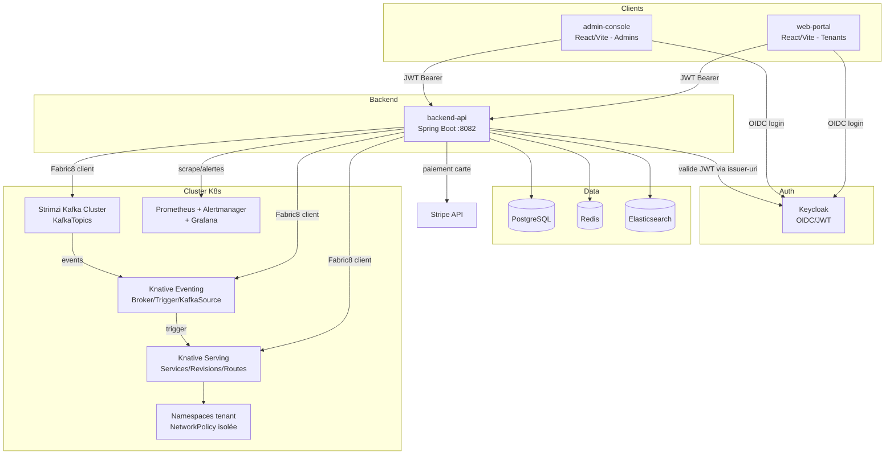
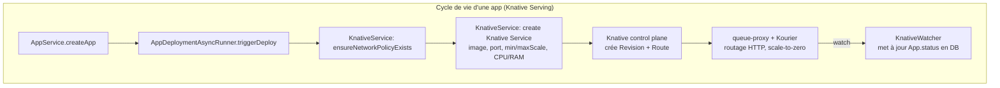
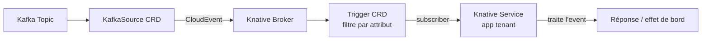
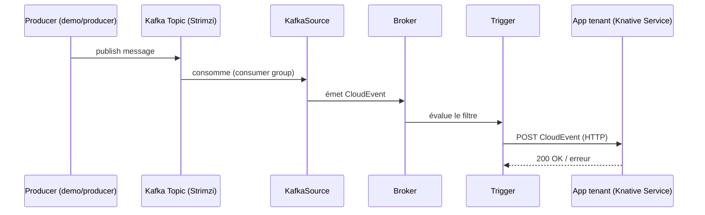
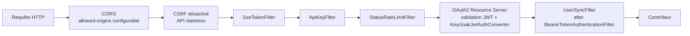
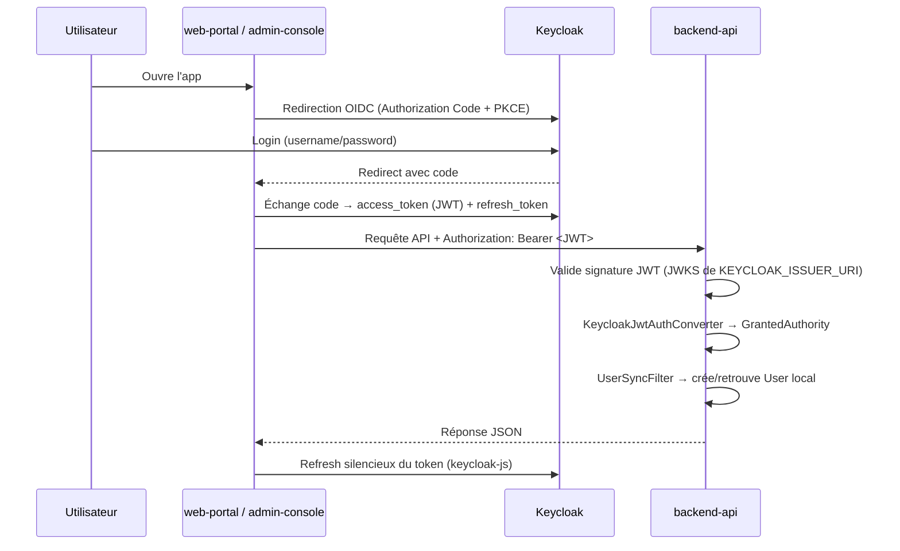
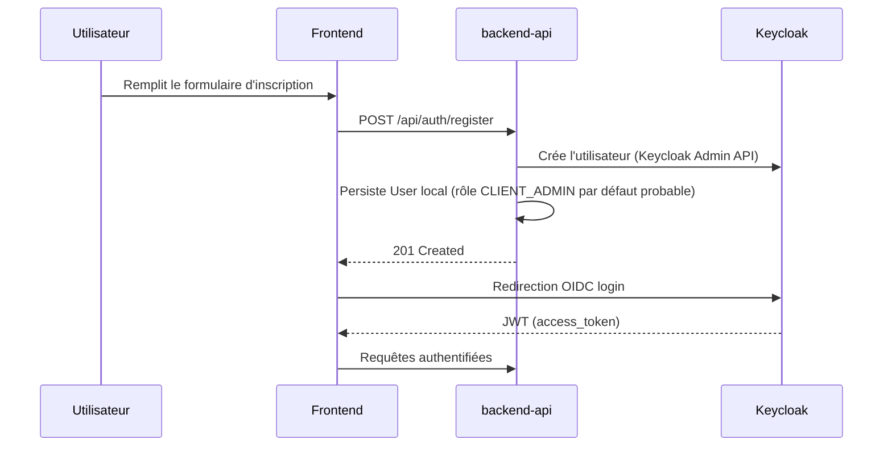
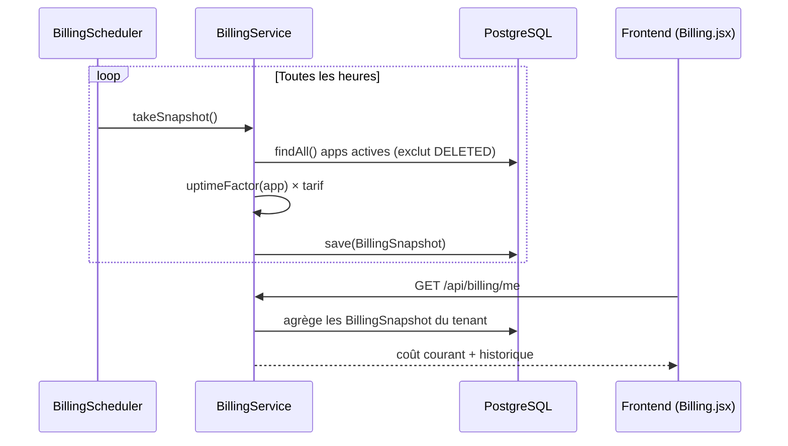
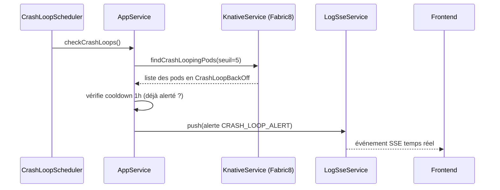
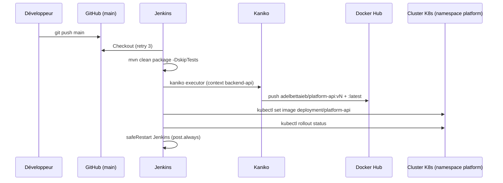

# Documentation Technique — PlatformServerless

> Document généré par analyse exhaustive du dépôt `platformserverless`. Toutes les affirmations sont ancrées dans le code source réel (chemins complets fournis). Lorsqu'une fonctionnalité évoquée dans les documents d'audit existants n'est pas retrouvée dans le code, cela est signalé explicitement par la mention **« Non implémenté dans ce dépôt »**.

## Table des matières

1. [Présentation du projet](#1-présentation-du-projet)
2. [Fonctionnalités](#2-fonctionnalités)
3. [Architecture Backend](#3-architecture-backend)
4. [Architecture Frontend](#4-architecture-frontend)
5. [Kubernetes](#5-kubernetes)
6. [Knative](#6-knative)
7. [Kafka](#7-kafka)
8. [Spring Boot — Classes documentées](#8-spring-boot--classes-documentées)
9. [API REST](#9-api-rest)
10. [Authentification](#10-authentification)
11. [Déploiement d'une application](#11-déploiement-dune-application)
12. [Monitoring](#12-monitoring)
13. [Logs](#13-logs)
14. [CI/CD](#14-cicd)
15. [Structure du dépôt](#15-structure-du-dépôt)
16. [Dépendances](#16-dépendances)
17. [Variables de configuration](#17-variables-de-configuration)
18. [Sécurité](#18-sécurité)
19. [Flux complets](#19-flux-complets)
20. [Analyse du code](#20-analyse-du-code)
21. [Résumé](#21-résumé)

---

## 1. Présentation du projet

### 1.1 Nom et objectif

Le dépôt implémente **PlatformServerless**, une plateforme multi-tenant de type PaaS (Platform-as-a-Service) permettant à des clients de déployer des applications conteneurisées sur un cluster Kubernetes en s'appuyant sur **Knative Serving** (scale-to-zero, autoscaling par requête) et **Knative Eventing + Kafka (Strimzi)** pour le event-driven. Le backend (`backend-api/`, Spring Boot 3.2.3 / Java 21) expose une API REST qui orchestre le cluster via le client Kubernetes Fabric8, tandis que deux frontends React distincts servent les utilisateurs finaux (`web-portal/`) et les administrateurs de la plateforme (`admin-console/`).

### 1.2 Problème résolu

Le projet répond au besoin d'une plateforme serverless interne (« Platform-as-a-Service ») où :
- un client peut déployer une image Docker existante sans gérer directement Kubernetes/Knative ;
- la facturation est calculée automatiquement selon la consommation réelle (CPU/RAM/uptime), pas sur un forfait fixe ;
- chaque tenant est isolé dans son propre namespace Kubernetes (isolation réseau via `NetworkPolicy`) ;
- les événements métier (Kafka) peuvent déclencher des services Knative via Knative Eventing (Broker/Trigger/KafkaSource) ;
- des outils d'administration (audit, gestion des clients, quotas, cluster overview) sont disponibles pour l'équipe opérant la plateforme.

### 1.3 Contexte

Le dépôt contient de très nombreux documents d'audit et de correctifs (`docs/audit-fixes/`, `AUDIT_COMPLET.md`, `AUDIT_PRODUCTION_READINESS.md`) qui montrent que le projet est en évolution active, avec des correctifs itératifs documentés un par un (billing, RBAC, network policy, alerting, rollback, Jenkins/Kaniko, etc.). C'est un projet pédagogique/portfolio structuré comme un vrai produit de plateforme cloud interne, avec un historique Git actif (`git log` récent : suppression du quota du nombre d'apps, correctifs CORS, etc.).

### 1.4 Architecture générale

Le système est composé de :
- **backend-api** : API REST Spring Boot, source de vérité métier (PostgreSQL), orchestrateur Kubernetes/Knative/Kafka, gestion facturation/paiement (Stripe), authentification déléguée à Keycloak.
- **web-portal** : frontend client (React + Vite), consommé par les tenants (déploiement d'apps, monitoring, facturation, équipe, Kafka).
- **admin-console** : frontend administrateur (React + Vite), consommé par l'équipe plateforme (gestion clients, cluster, audit, facturation globale).
- **cloudevent-viewer** : petit service Node.js (Express probable) pour visualiser des CloudEvents.
- **microservices/** et **demo/** : services Node.js de démonstration (producer/consumer Kafka, order-service, notification-service) utilisés pour tester le event-driven.
- **k8s/** : manifests Kubernetes bruts (pas de Helm/Kustomize) pour déployer backend, frontend, admin, monitoring, sauvegarde, RBAC, NetworkPolicy.
- **ci-cd/** : Dockerfiles et pipelines Jenkins (4 pipelines indépendants, build via Kaniko in-cluster, push Docker Hub).

### 1.5 Technologies

| Domaine | Technologies |
|---|---|
| Backend | Java 21, Spring Boot 3.2.3, Spring Security (OAuth2 Resource Server), Spring Data JPA, Spring Data Redis, Spring Data Elasticsearch, Spring WebSocket/WebFlux |
| Orchestration | Kubernetes (client Fabric8 `kubernetes-client` 6.10.0), Knative Serving, Knative Eventing, Strimzi (Kafka sur K8s) |
| Base de données | PostgreSQL (JPA), Redis, Elasticsearch (logs/metrics) |
| Messagerie | Apache Kafka (`kafka-clients`), Knative `KafkaSource` |
| Auth | Keycloak (OAuth2/OIDC, JWT), Spring Security |
| Paiement | Stripe (`stripe-java`) |
| Frontend | React 18, Vite 5, React Router 6, MUI 5, TailwindCSS 3, Recharts, Keycloak-js, Axios, `@microsoft/fetch-event-source` (SSE) |
| CI/CD | Jenkins (agent unique), Kaniko (build d'image in-cluster), Docker Hub (registre) |
| Monitoring | Prometheus, Alertmanager, Grafana (dashboard JSON fourni), Micrometer (`micrometer-registry-prometheus`) |
| Autres | Lombok, JJWT, Apache POI (`poi-ooxml`, exports Excel), springdoc-openapi (Swagger) |

### 1.6 Diagramme d'architecture générale



---

## 2. Fonctionnalités

| Fonctionnalité | Description | Composants | API | Technologies |
|---|---|---|---|---|
| Authentification / inscription | Login délégué à Keycloak (JWT Bearer) ; inscription crée un utilisateur Keycloak + ligne locale `User` | `AuthController`, `AuthService`, `KeycloakAdminService` | `POST /api/auth/register` | Keycloak Admin REST API, JWT |
| Gestion des utilisateurs | Profil, liste (admin), changement de rôle | `UserController`, `UserService`, `UserSyncFilter` | `/api/users/**` | JPA, Spring Security |
| Déploiement d'applications | Créer/mettre à jour/supprimer/rollback une app à partir d'une image Docker, déployée en Knative Service | `AppController`, `AppService`, `KnativeService`, `KnativeServiceHelper`, `AppDeploymentAsyncRunner` | `/api/apps/**` | Fabric8 Kubernetes Client, Knative Serving |
| Suivi temps réel du statut | Watch Kubernetes (informer) pour synchroniser le statut DB ↔ cluster | `KnativeWatcher` | interne | Fabric8 `Watcher` |
| Détection crash-loop | Job planifié détectant les pods en CrashLoopBackOff et générant une alerte | `CrashLoopScheduler`, `AppService.checkCrashLoops` | interne (SSE push) | Spring `@Scheduled` |
| Rollback de révision | Lister les révisions Knative et revenir à une révision précédente | `AppController`, `KnativeService.rollbackToRevision` | `GET /api/apps/{id}/revisions`, `POST /api/apps/{id}/rollback/{revisionName}` | Knative Revisions |
| Gestion Kafka (topics) | CRUD de `KafkaTopic` Strimzi | `KafkaController`, `KafkaService` | `/api/kafka/topics/**` | Strimzi CRD `KafkaTopic` |
| Knative Eventing | Création de `KafkaSource` et `Trigger` reliant Kafka aux apps Knative | `EventingController`, `EventingService` | `/api/eventing/**` | Knative Eventing/Sources CRDs |
| Ingestion CloudEvents | Endpoint générique de réception d'événements | `EventController`, `EventService` | `POST /api/events` | CloudEvents |
| Clés API | Génération de clés API pour authentification machine-à-machine | `ApiKeyController`, `ApiKeyService`, `ApiKeyFilter` | `/api/apikeys/**` | Filtre Spring Security custom |
| Logs de déploiement | Historique des logs de déploiement, logs applicatifs (pods), streaming SSE | `LogController`, `LogService`, `PodLogService`, `PodLogStreamService`, `LogSseService` | `/api/logs/**` | Elasticsearch, Fabric8 pod logs, SSE |
| Métriques | Métriques par app et par cluster, streaming SSE | `MetricsController`, `MetricsService` | `/api/metrics/**` | Prometheus HTTP API |
| Alerting | Récupération des alertes Alertmanager | `AlertmanagerService`, `AdminController` (`/cluster/alerts`) | `GET /api/admin/cluster/alerts` | Alertmanager API |
| Facturation | Facturation à l'usage (CPU/RAM/uptime), snapshots horaires, export | `BillingController`, `BillingService`, `BillingScheduler`, `BillingExportService`, `BillingSnapshot` | `/api/billing/**` | Apache POI (export Excel), `@Scheduled` |
| Facturation / factures | Génération de factures, paiement, suspension pour impayé | `InvoiceController`, `InvoiceService`, `AppInvoice` | `/api/invoices/**` | JPA |
| Paiement | Intégration Stripe (setup intent, méthodes de paiement, webhook) | `PaymentController`, `PaymentService`, `PaymentTransaction` | `/api/payment/**` | `stripe-java` |
| Quotas | Quotas de ressources par tenant, synchronisés en `ResourceQuota` K8s | `QuotaService`, `TenantQuota` | via `AdminController` (`/clients/{userId}/quota`) | K8s `ResourceQuota` |
| Équipe (multi-utilisateur tenant) | Un `CLIENT_ADMIN` peut inviter des `MEMBER` avec permissions individuelles | `TeamController`, `TeamService`, `Permission`, `PermissionService` | `/api/team/**` | JPA, permissions custom |
| Administration plateforme | Vue globale : stats, apps, clients, cluster (nodes/pods/namespaces/stockage), suspension client/app | `AdminController` | `/api/admin/**` | Fabric8 (lecture cluster) |
| Audit log | Journalisation des actions admin, export | `AdminAuditLogService`, `AdminAuditLogExportService`, `AdminAuditLog` | `/api/admin/audit-log**` | Apache POI |
| Page de statut public | Statut public de la plateforme + incidents, avec rate limiting | `StatusController`, `StatusService`, `StatusRateLimitFilter`, `Incident` | `/api/status/**` | Filtre custom |
| Sauvegarde | CronJobs K8s de sauvegarde Postgres et snapshot Elasticsearch | `k8s/backup/*.yaml` | — | K8s CronJob |
| Sécurité réseau tenant | NetworkPolicy default-deny par namespace tenant, créée automatiquement | `KnativeService.ensureNetworkPolicyExists`, `k8s/tenant/network-policy.yaml` | interne | K8s `NetworkPolicy` |

---

## 3. Architecture Backend

### 3.1 Organisation des packages

Le code source (`backend-api/src/main/java/com/platform/api/`) est organisé **par domaine métier** (« package by feature »), chaque package regroupant entité, repository, service, contrôleur et DTOs :

```
com.platform.api
├── BackendApiApplication.java      (point d'entrée Spring Boot)
├── DockerImage/                    (validation/nom d'image Docker)
├── admin/                          (AdminController — vue plateforme)
├── apikey/                         (clés API)
├── app/                            (cœur métier : App, déploiement Knative)
├── audit/                          (journal d'audit admin)
├── auth/                           (inscription, intégration Keycloak Admin)
├── billing/                        (facturation à l'usage + factures)
├── config/                         (config Kubernetes, OpenAPI, WebSocket)
├── eventing/                       (Knative Eventing : KafkaSource, Trigger)
├── exception/                      (exceptions métier + handler global)
├── kafka/                          (gestion des KafkaTopic Strimzi)
├── logs/                           (logs déploiement + pod logs + SSE)
├── metrics/                        (métriques Prometheus + alerting)
├── payment/                        (Stripe)
├── quota/                          (quotas ressources tenant)
├── status/                         (page de statut public)
├── team/                           (gestion d'équipe / permissions)
└── user/                           (utilisateurs, rôles, permissions)
```

### 3.2 Couches applicatives

Chaque domaine suit globalement une architecture en couches classique Spring :

```mermaid
graph LR
    C[Controller<br/>@RestController] --> S[Service<br/>@Service - logique métier]
    S --> R[Repository<br/>Spring Data JPA]
    S --> K8S[Fabric8 KubernetesClient<br/>Knative/Kafka/Pods]
    S --> EXT[APIs externes<br/>Keycloak Admin / Stripe / Prometheus]
    R --> DB[(PostgreSQL)]
    C -.->|DTO request/response| S
```

- **Contrôleurs** (`@RestController`) : validation d'entrée (Bean Validation), extraction de l'identité (`Authentication`/`Jwt`), délégation au service, mapping HTTP.
- **Services** (`@Service`) : logique métier, transactions (`@Transactional`), appels au client Kubernetes Fabric8, appels HTTP externes (Prometheus, Alertmanager, Keycloak Admin REST, Stripe SDK).
- **Repositories** (`JpaRepository`) : accès PostgreSQL. Certains domaines (logs, métriques) utilisent en plus des documents Elasticsearch (`LogDocument`, `MetricDocument`).
- **Entités JPA** (`@Entity`) : `App`, `User`, `ApiKey`, `AppInvoice`, `BillingSnapshot`, `KafkaTopic`, `KafkaSource`, `Trigger`, `DeploymentLog`, `AdminAuditLog`, `PaymentTransaction`, `TenantQuota`, `Incident`.
- **DTOs** (`dto/` par package) : séparent le modèle de persistance du contrat API (ex : `AppRequest`/`AppResponse`, `AuthResponse`, `TriggerDto`, `KafkaSourceDto`, `MetricDto`).
- **Sécurité** (`security/`) : convertisseur JWT Keycloak, filtres custom (SSE token, API Key, synchronisation utilisateur).
- **Config** (`config/`) : `KubernetesConfig` (bean `KubernetesClient`), `OpenApiConfig` (Swagger), `WebSocketConfig`.

### 3.3 Asynchronisme et watch cluster

Le déploiement d'une app est **asynchrone** : `AppService.createApp()` persiste immédiatement l'entité en statut `DEPLOYING` puis délègue à `AppDeploymentAsyncRunner.triggerDeploy()` (exécution en arrière-plan) qui appelle `KnativeService` pour créer réellement le Knative Service. En parallèle, `KnativeWatcher` maintient un **watch** Fabric8 sur les ressources Knative pour répercuter les changements de statut cluster → base de données en temps réel, complété par une resynchronisation active dans `AppService.syncStatusFromKubernetes()` à chaque lecture.

---

## 4. Architecture Frontend

Le dépôt contient **deux applications frontend indépendantes**, toutes deux React 18 + Vite 5 + React Router 6 + MUI 5 + TailwindCSS, partageant la même structure de dossiers.

### 4.1 web-portal (portail client / tenant)

```
web-portal/src/
├── main.jsx                 (bootstrap React + Keycloak)
├── App.jsx                  (routing)
├── api/
│   ├── client.js             (instance Axios configurée)
│   ├── index.js               (fonctions d'appel API par domaine)
│   └── sse.js                 (client Server-Sent Events, @microsoft/fetch-event-source)
├── auth/keycloak.js          (init keycloak-js)
├── context/
│   ├── AuthContext.jsx        (état utilisateur, login/logout)
│   ├── NotificationContext.jsx
│   └── ThemeContext.jsx       (thème clair/sombre)
├── components/ (Card, Layout, Logo, Sidebar, Terminal, Toast)
└── pages/
    (Dashboard, AppsList, DeployApp, AppDetails, KafkaTopics, Eventing,
     LogsView, Monitoring, Settings, Billing, Team, StatusPage, Login, Register, Agenda)
```

#### Routing (`App.jsx`)

| Route | Page | Protection |
|---|---|---|
| `/` | redirige vers `/login` | — |
| `/status` | `StatusPage` | publique |
| `/login`, `/register` | `Login`, `Register` | publique (redirige si déjà connecté) |
| `/dashboard` | `Dashboard` | authentifié |
| `/apps`, `/apps/new`, `/apps/:name` | `AppsList`, `DeployApp`, `AppDetails` | authentifié |
| `/kafka` | `KafkaTopics` | authentifié |
| `/eventing` | `Eventing` | authentifié |
| `/logs` | `LogsView` | authentifié |
| `/monitoring` | `Monitoring` | authentifié |
| `/billing` | `Billing` | authentifié |
| `/team` | `Team` | authentifié **et** `role === 'CLIENT_ADMIN'` (via `ClientAdminRoute`) |
| `/settings` | `Settings` | authentifié |

Le fichier `App.jsx` contient un commentaire explicite : l'administration globale des utilisateurs/rôles a été **retirée du web-portal et déplacée intégralement vers `admin-console`** — le web-portal n'a donc plus aucune surface d'administration plateforme.

#### État et authentification

- `AuthContext` gère l'utilisateur courant, l'état de chargement, et s'appuie sur `auth/keycloak.js` (bibliothèque `keycloak-js`) pour l'OIDC (login redirect, refresh de token silencieux).
- Les appels API (`api/client.js`) injectent le token Bearer Keycloak dans l'en-tête `Authorization`.
- `api/sse.js` ouvre des connexions Server-Sent Events authentifiées (probablement via un token passé en query string, cf. `SseTokenFilter` côté backend) pour les logs (`LogsView`) et métriques temps réel (`Monitoring`).

### 4.2 admin-console (console d'administration plateforme)

Structure quasi identique (`App.jsx`, `api/`, `auth/keycloak.js`, `context/`, `components/`), mais les pages sont dédiées à l'administration :

```
admin-console/src/pages/admin/
├── AdminDashboard.jsx
├── AdminClients.jsx
├── AdminUsers.jsx
├── AdminBilling.jsx
├── AdminAuditLog.jsx
└── ClusterManagement.jsx
```

Ces pages consomment les endpoints `/api/admin/**` (stats, clients, cluster nodes/pods/namespaces/stockage, audit log, facturation globale) exposés par `AdminController`.

### 4.3 Build & déploiement des frontends

Les deux apps sont buildées en statique (Vite `build`) puis servies par **Nginx** (`nginx.conf` présent dans chaque dossier), packagées en image Docker (`ci-cd/docker/frontend.Dockerfile`, `admin.Dockerfile`, et leurs variantes `-kaniko.Dockerfile`), déployées comme `Deployment`+`Service` Kubernetes (`k8s/frontend/deployment.yaml`, `k8s/admin/deployment.yaml`) exposés en `LoadBalancer`/`NodePort`.

---

## 5. Kubernetes

Le dépôt ne contient **aucun Helm chart ni Kustomize overlay** — uniquement des manifests YAML bruts appliqués manuellement (`kubectl apply`). Tous vivent dans `k8s/`.

### 5.1 `k8s/backend/deployment.yaml`

`Deployment` + `Service` du backend (`platform-api`, namespace `platform`, 1 réplica). Le conteneur écoute sur `8082` et reçoit sa configuration entièrement par variables d'environnement (profil `k8s`, URL Postgres, secrets Keycloak/Postgres via `secretKeyRef` sur le `Secret` `platform-api-secrets`, URL Keycloak publique vs interne — un commentaire souligne que `KEYCLOAK_ISSUER_URI` doit être l'URL **publique** car Spring compare littéralement la revendication `iss` du JWT, pas une simple joignabilité réseau —, liste CORS explicite couvrant IP LoadBalancer + NodePorts 30081/31088 sur les 3 nœuds, URLs internes Prometheus/Alertmanager/Kafka). Le `Service` est de type `LoadBalancer` (probablement MetalLB, cf. §5 ci-dessous).

### 5.2 `k8s/backend/rbac.yaml`

Définit les permissions RBAC du `ServiceAccount default` du namespace `platform` (aucun ServiceAccount dédié créé). Deux paires ClusterRole/ClusterRoleBinding :
- `platform-api-cluster-reader` : lecture seule sur `nodes`/`events`.
- `platform-backend-role` (lié par `platform-correct-binding`) : le plus large — `pods/services/deployments/namespaces` en **create/update/delete à portée cluster entier** (pas restreint aux namespaces tenant), `serving.knative.dev` (services/revisions/routes), `eventing.knative.dev`/`sources.knative.dev` (brokers/triggers/kafkasources), `kafka.strimzi.io` (kafkatopics), `pods/log`, `persistentvolumeclaims`, `resourcequotas`, `networking.k8s.io/networkpolicies`.

Le fichier contient des commentaires d'audit très détaillés (issus du « ticket 006 » et « ticket 009 ») expliquant que ce fichier a été **reconstruit a posteriori** à partir de l'état réel du cluster (`kubectl get clusterrole ... -o yaml`) car deux ressources vivaient sur le cluster sans être versionnées, et que deux permissions manquantes (`persistentvolumeclaims`, `resourcequotas`) faisaient échouer silencieusement `AdminController.getStorage()` et `QuotaService.syncToCluster()`. Le document souligne aussi, sans le corriger, que la portée cluster-wide des verbes destructeurs est plus large que nécessaire.

### 5.3 `k8s/frontend/deployment.yaml` et `k8s/admin/deployment.yaml`

`Deployment`+`Service` Nginx statiques pour `platform-web` (web-portal) et l'admin-console (fichier `k8s/admin/deployment.yaml`, non détaillé ci-dessus mais suivant le même modèle), exposés en `LoadBalancer`.

### 5.4 `k8s/tenant/network-policy.yaml`

Manifeste template (`NAMESPACE_PLACEHOLDER` à substituer) de `NetworkPolicy` default-deny pour un namespace tenant : autorise le trafic intra-namespace, l'ingress depuis `kourier-system` (routage public Knative), `knative-serving` (control plane) et `monitoring` (scraping Prometheus) ; l'egress vers DNS (`kube-system`, port 53), le namespace `kafka`, et retour vers `knative-serving`/`kourier-system`. Tout le reste (y compris trafic direct vers d'autres tenants ou vers Postgres/Keycloak du namespace `platform`) est refusé. Ce manifeste sert de filet de sécurité pour les namespaces déjà existants avant que `KnativeService.ensureNetworkPolicyExists()` ne génère automatiquement cette policy pour chaque nouveau namespace tenant créé par le backend.

### 5.5 `k8s/backup/`

- `postgres-backup-cronjob.yaml` : `CronJob` de sauvegarde périodique de PostgreSQL.
- `elasticsearch-snapshot-cronjob.yaml` : `CronJob` de snapshot Elasticsearch (logs/métriques).
- `backup-secret.example.yaml` : exemple de `Secret` (identifiants de stockage de sauvegarde) — fichier `.example`, à instancier manuellement (pas de secret réel commité).

### 5.6 `k8s/monitoring/`

- `alert-rules.yaml` : règles d'alerte Prometheus (probablement crash-loop, latence, erreurs 5xx, budget de facturation — cohérent avec `docs/FIX_06_ALERTING_BUDGET.md` et `FIX_07_CRASH_LOOP_DETECTION.md`).
- `alertmanager-config.yaml` : configuration de routage des alertes Alertmanager.
- `queue-proxy-podmonitor.yaml` : `PodMonitor` Prometheus Operator ciblant le sidecar `queue-proxy` de Knative (métriques de concurrence/latence par revision).
- `service-monitor.yaml` : `ServiceMonitor` Prometheus Operator pour scraper `backend-api` (`/actuator/prometheus` exposé via Micrometer).
- `scrape-config.yaml` : configuration de scraping additionnelle.

### 5.7 `k8s/grafana/platform-tenant-dashboard.json`

Dashboard Grafana JSON prêt à l'import, dédié à la vue « par tenant » (probable : CPU/RAM par app, requêtes/s, coût).

### 5.8 MetalLB / Kourier / Cilium

**Non trouvés en tant que manifestes dans ce dépôt.** Leur usage est déduit indirectement : les `Service` de type `LoadBalancer` (`platform-api`, `platform-web`, etc.) reçoivent des IP externes (`10.9.21.x`) typiques d'un déploiement **MetalLB** sur cluster bare-metal/VM, et Knative Serving s'appuie généralement sur **Kourier** comme ingress-gateway (référencé indirectement par le namespace `kourier-system` cité dans `network-policy.yaml`). **Aucun fichier de configuration MetalLB, Kourier ou Cilium n'est présent dans le dépôt** — ces composants sont probablement installés directement sur le cluster hors du contrôle de version (cohérent avec la contrainte « pas d'accès direct au cluster » mentionnée dans les documents d'audit).

### 5.9 ConfigMaps / Secrets

Aucun manifeste `ConfigMap` ou `Secret` n'est versionné dans `k8s/` (hormis l'exemple `backup-secret.example.yaml`) : la configuration passe par des variables d'environnement en clair dans les `Deployment` (dont, selon `AUDIT_COMPLET.md`, un mot de passe Postgres en clair) et par des `Secret` référencés (`platform-api-secrets`) mais **créés hors dépôt** (non versionnés — cohérent avec la politique de sécurité de ne pas committer de secrets réels).

---

## 6. Knative

### 6.1 Knative Serving

Chaque application déployée par un tenant devient un **Knative Service** (`serving.knative.dev/v1`), géré par `backend-api/src/main/java/com/platform/api/app/KnativeService.java` (559 lignes) et son helper `KnativeServiceHelper.java`. Les opérations couvertes :
- création/mise à jour (déploiement, image, port, ressources CPU/RAM, `minScale`/`maxScale` mappés depuis `minReplicas`/`maxReplicas`) ;
- lecture du statut réel (`getRealStatus`) → mappé en `RUNNING`/`SCALED_TO_ZERO`(IDLE)/`FAILED`/`DEPLOYING`/`NOT_FOUND` ;
- lecture du nombre de pods prêts (`getReadyPods`) ;
- liste des révisions (`listRevisions`) et rollback (`rollbackToRevision`) — implémenté en manipulant le split de trafic Knative (Route) vers une révision antérieure ;
- récupération du message d'échec (`getFailureMessage`) pour affichage utilisateur ;
- détection des pods en CrashLoopBackOff (`findCrashLoopingPods`) ;
- création automatique d'un namespace tenant + `NetworkPolicy` isolée (`ensureNetworkPolicyExists`) à la première app d'un nouvel utilisateur/namespace ;
- suppression (`delete`).



### 6.2 Knative Eventing

Le package `eventing/` implémente le pont Kafka → Knative :
- **`KafkaSource`** (entité + CRD `sources.knative.dev`) : source d'événements consommant un topic Kafka, produisant des CloudEvents vers un `Broker` ou directement vers un `subscriber` Knative.
- **`Trigger`** (entité + CRD `eventing.knative.dev`) : filtre les CloudEvents (par attribut, champ `filter`) et les route vers le Knative Service abonné (`subscriberName`).
- `EventingService.java` (483 lignes) contient la logique de création/suppression de ces ressources via le client Fabric8, la résolution du topic Kafka lié à une app (utilisée par `AppService.resolveKafkaTopic/resolveConsumerGroup/resolveKafkaSourceName/resolveTriggerFilter`).
- `EventingController` expose `/api/eventing/sources` et `/api/eventing/triggers` (CRUD).
- `EventController`/`EventService` : endpoint générique `POST /api/events` pour ingestion manuelle d'un CloudEvent (probablement à des fins de test/démo).



---

## 7. Kafka

### 7.1 Strimzi

Le cluster Kafka est géré par **Strimzi** (CRD `kafka.strimzi.io`). Le backend ne déploie pas le cluster Kafka lui-même (aucun manifeste `Kafka` CR trouvé dans `k8s/`) mais gère les **topics** via la CRD `KafkaTopic`, accessible en RBAC (voir §5.2). `KafkaService.java` (264 lignes, package `kafka/`) encapsule le CRUD Fabric8 sur cette CRD ; `KafkaTopic.java` est l'entité JPA miroir en base (métadonnées applicatives : nom, partitions, réplication, propriétaire) ; `KafkaController` expose `/api/kafka/topics` (POST créer, GET lister, GET par id, DELETE).

### 7.2 Producers / Consumers de démonstration

- `demo/producer/index.js` : producteur Kafka Node.js de démonstration.
- `microservices/order-service/index.js`, `microservices/notification-service/index.js` : microservices Node.js illustrant un flux event-driven (commande → notification), consommant/produisant vraisemblablement sur des topics Kafka créés via la plateforme.
- `cloudevent-viewer/server.js` : visualiseur de CloudEvents (probablement un endpoint HTTP affichant les événements reçus, utile pour déboguer les `Trigger`/`KafkaSource`).

### 7.3 Flux d'événements bout en bout



---

## 8. Spring Boot — Classes documentées

> Vue d'ensemble des classes par package. Le détail exhaustif méthode par méthode de `AppService` est donné en §3.3/§11 ; les autres classes majeures sont résumées ci-dessous avec leur rôle.

### 8.1 `com.platform.api` (racine)
- **`BackendApiApplication`** — classe `@SpringBootApplication`, point d'entrée `main()`.

### 8.2 `admin/`
- **`AdminController`** (`@RestController`, `/api/admin`) — 27 endpoints : stats plateforme, gestion des apps/topics (admin), logs, vue cluster complète (nodes, namespaces, pods, storage, services Knative, brokers Kafka, alertes, events, composants système, overview), suspension/restauration app et client, quotas par client, audit log + export.

### 8.3 `apikey/`
- **`ApiKey`** (`@Entity`) — clé API (hash, propriétaire, date création/expiration).
- **`ApiKeyRepository`** — accès JPA.
- **`ApiKeyService`** — génération/validation/révocation de clés.
- **`ApiKeyController`** (`/api/apikeys`) — GET liste, POST créer, DELETE révoquer.

### 8.4 `app/` (cœur métier)
- **`App`** (`@Entity`) — application déployée (nom, image, tag, port, min/maxReplicas, CPU/RAM, serviceName, namespace, status, timestamps).
- **`AppController`** (`/api/apps`) — CRUD + déploiement + rollback (détail en §9).
- **`AppService`** — logique métier complète (voir extrait de code §3.3 ; création, lecture avec sync cluster, update/redeploy, delete logique, rollback, détection crash-loop).
- **`AppDeploymentAsyncRunner`** — exécute le déploiement Knative en tâche asynchrone pour ne pas bloquer la requête HTTP de création.
- **`KnativeService`** — orchestration Knative (voir §6.1).
- **`KnativeServiceHelper`** — construction des manifestes Knative (specs JSON/YAML Fabric8) séparée de la logique d'orchestration.
- **`KnativeWatcher`** — watch Fabric8 asynchrone sur les ressources Knative, met à jour `App.status` en base en temps réel (`updateAppsInDb`), démarré/arrêté via `startWatch()`/`stopWatch()`.
- **`CrashLoopScheduler`** — tâche planifiée (`@Scheduled`) appelant `AppService.checkCrashLoops()` périodiquement.
- **`dto/AppRequest`, `dto/AppResponse`** — contrats d'entrée/sortie API.

### 8.5 `audit/`
- **`AdminAction`** (enum probable) — types d'action journalisées.
- **`AdminAuditLog`** (`@Entity`) — entrée de journal (acteur, action, cible, date).
- **`AdminAuditLogRepository`**, **`AdminAuditLogService`** — persistance et requêtage.
- **`AdminAuditLogExportService`** — export Excel (Apache POI) du journal d'audit.
- **`dto/AdminAuditLogResponse`** — DTO de sortie.

### 8.6 `auth/`
- **`AuthController`** (`/api/auth`) — `POST /register` (seul endpoint, le login passe directement par Keycloak côté frontend).
- **`AuthService`** — logique d'inscription (création utilisateur local + Keycloak).
- **`KeycloakAdminService`** — appels à l'API Admin REST de Keycloak (création d'utilisateur, attribution de rôle réalm).
- **`dto/AuthResponse`, `dto/LoginRequest`, `dto/RegisterRequest`** — DTOs.

### 8.7 `billing/`
- **`AppInvoice`** (`@Entity`), **`AppInvoiceRepository`** — factures par app.
- **`BillingSnapshot`** (`@Entity`), **`BillingSnapshotRepository`** — snapshot horaire du coût d'une app.
- **`BillingService`** — cœur du calcul de facturation : `takeSnapshot()` (job horaire), `getMyBilling()`, `getPlatformBilling()`, `buildClientBilling()`, fonction `uptimeFactor(App)` pondérant le coût selon le statut (`RUNNING`=1.0, `FAILED`=0.0, autres statuts actifs=0.2). **Correctif documenté** (`docs/audit-fixes/050-billing-continue-apres-suppression.md`, fichier modifié dans le git status courant) : exclusion explicite des apps `DELETED` des 4 points de calcul de coût *à venir*, tout en préservant l'historique déjà facturé.
- **`BillingScheduler`** — planifie l'appel horaire à `takeSnapshot()`.
- **`BillingExportService`** — export Excel de l'historique de facturation.
- **`BillingController`** (`/api/billing`) — `/me`, `/admin`, `/admin/snapshot` (déclenchement manuel), `/export`.
- **`InvoiceController`** (`/api/invoices`), **`InvoiceService`** — génération de factures, paiement, détection des impayés (`/admin/overdue`), suspension d'app pour facture impayée.
- **`dto/AdminBillingResponse`, `dto/BillingHistoryResponse`, `dto/DailyCostDto`** — DTOs.

### 8.8 `config/`
- **`KubernetesConfig`** — bean Spring exposant le `KubernetesClient` Fabric8 configuré (in-cluster ou kubeconfig selon profil).
- **`OpenApiConfig`** — configuration Swagger/OpenAPI (springdoc), titre « Serverless Platform API ».
- **`WebSocketConfig`** — configuration WebSocket (canal probable pour notifications temps réel en plus du SSE).

### 8.9 `eventing/`
Voir §6.2 pour le détail fonctionnel. Classes : `KafkaSource`, `KafkaSourceRepository`, `Trigger`, `TriggerRepository`, `EventingService`, `EventingController`, `EventController`, `EventService`, DTOs `KafkaSourceDto`/`TriggerDto`.

### 8.10 `exception/`
- **`ConflictException`, `NotFoundException`, `UnauthorizedException`** — exceptions métier typées (mappées en codes HTTP 409/404/401-403).
- **`GlobalExceptionHandler`** (`@RestControllerAdvice`) — traduction centralisée des exceptions en réponses HTTP structurées.

### 8.11 `kafka/`
`KafkaTopic` (entité), `KafkaTopicRepository`, `KafkaService`, `KafkaController`, `KafkaTopicDto`, `dto/CreateTopicRequest`.

### 8.12 `logs/`
- **`DeploymentLog`** (`@Entity`) — événement de cycle de vie d'une app (déploiement, update, rollback, suppression, alerte crash-loop).
- **`DeploymentLogRepository`** — accès JPA.
- **`LogDocument`** — document Elasticsearch (logs applicatifs indexés).
- **`LogService`** — requêtage des logs (par app/utilisateur).
- **`PodLogService`** — récupération ponctuelle des logs d'un pod via Fabric8.
- **`PodLogStreamService`** — streaming continu des logs de pod (`kubectl logs -f` équivalent programmatique).
- **`LogSseService`** — hub de diffusion Server-Sent Events pour pousser les nouveaux logs/alertes en temps réel aux clients connectés.
- **`LogController`** (`/api/logs`) — `/apps/{id}`, `/users/{id}`, `/me`, `/stream` (SSE), `/apps/{id}/pod-logs/stream` (SSE).

### 8.13 `metrics/`
- **`Metric`** (`@Entity`), **`MetricDocument`** (Elasticsearch), **`MetricRepository`**.
- **`MetricsService`** — interroge l'API HTTP Prometheus (PromQL) pour construire les réponses.
- **`AlertmanagerService`** — interroge l'API Alertmanager pour les alertes actives.
- **`MetricsController`** (`/api/metrics`) — `/apps/{id}`, `/cluster`, `/apps/{id}/stream` (SSE), `/cluster/stream` (SSE).

### 8.14 `payment/`
- **`PaymentTransaction`** (`@Entity`), **`PaymentTransactionRepository`**.
- **`PaymentService`** — intégration Stripe (SetupIntent pour enregistrer une carte, liste/suppression des méthodes de paiement, paiement, traitement du webhook Stripe).
- **`PaymentController`** (`/api/payment`) — `/config`, `/setup-intent`, `/methods`, `/methods/{id}` (DELETE), `/pay`, `/transactions`, `/webhook` (public, signé Stripe).

### 8.15 `quota/`
- **`TenantQuota`** (`@Entity`), **`TenantQuotaRepository`**.
- **`QuotaService`** — `syncToCluster()` traduit les quotas applicatifs en objet `ResourceQuota` Kubernetes par namespace tenant (dépend des permissions RBAC ajoutées au ticket 006, voir §5.2).
- DTOs : `TenantQuotaResponse`, `UpdateQuotaRequest`.

### 8.16 `security/`
- **`KeycloakJwtAuthConverter`** — extrait les rôles realm Keycloak (`realm_access.roles`) et les mappe en `GrantedAuthority` `ROLE_*` ; détermine le nom principal (`preferred_username` > `email` > `sub`).
- **`SseTokenFilter`** — permet l'authentification des connexions SSE (le header `Authorization` n'étant pas envoyable nativement par `EventSource`, un token est probablement passé en query string).
- **`UserSyncFilter`** — synchronise/crée l'entité `User` locale à la première requête authentifiée d'un utilisateur Keycloak connu.
- **`ApiKeyFilter`** — authentifie les requêtes machine-à-machine via en-tête de clé API.
- **`SecurityConfig`** — chaîne de filtres Spring Security (détail §10).

### 8.17 `status/`
`Incident` (entité), `IncidentRepository`, `StatusService`, `StatusController` (`/api/status`, `/api/status/incidents`), `StatusRateLimitFilter` (protège l'endpoint public contre l'abus), `dto/PublicStatusResponse`.

### 8.18 `team/`
`TeamController` (`/api/team`), `TeamService`, `dto/AddMemberRequest` — gestion des membres d'équipe et de leurs permissions individuelles (`Permission`).

### 8.19 `user/`
- **`User`** (`@Entity`) — utilisateur local (id Keycloak, username, email, rôle, namespace, `clientAdminId` pour les membres).
- **`UserRole`** (enum) — `ADMIN` (propriétaire plateforme), `CLIENT_ADMIN` (gère sa propre équipe), `MEMBER` (accès gated individuellement par `Permission`).
- **`Permission`** (enum probable) — droits granulaires (déployer, voir logs, voir métriques, Kafka, facturation…) attribuables à un `MEMBER`.
- **`PermissionService`** — vérifie qu'un utilisateur possède une permission donnée.
- **`UserContextService`** — résout le « propriétaire effectif » d'une requête : si l'appelant est un `MEMBER`, retourne l'id/namespace de son `CLIENT_ADMIN` (pattern central utilisé par `AppService`, voir extrait §3.3 : `ctx.effectiveUserId()`/`ctx.namespace()`).
- **`UserRepository`**, **`UserService`**, **`UserController`** (`/api/users`), DTOs `CreateUserRequest`/`UpdateUserRequest`/`UserDto`.

### 8.20 `DockerImage/`
- **`DockerImage`** — utilitaire/valeur représentant une image Docker (nom, tag), probablement utilisé pour valider/parsing le champ `imageName` d'`AppRequest`.

---

## 9. API REST

> Base path commun : `/api`. Authentification par défaut : Bearer JWT (Keycloak) sauf mention « public » ou « clé API ». Tableau construit depuis les annotations `@RequestMapping`/`@*Mapping` de chaque contrôleur.

### 9.1 Auth — `AuthController` (`/api/auth`)
| Méthode | URL | Auth | Description |
|---|---|---|---|
| POST | `/api/auth/register` | Publique | Inscription : crée l'utilisateur dans Keycloak + entité `User` locale |

### 9.2 Utilisateurs — `UserController` (`/api/users`)
| Méthode | URL | Auth | Description |
|---|---|---|---|
| GET | `/api/users/me` | JWT | Profil de l'utilisateur courant |
| PATCH | `/api/users/me` | JWT | Mise à jour du profil courant |
| GET | `/api/users` | JWT (admin) | Liste des utilisateurs |
| PATCH | `/api/users/{id}/role` | JWT (admin) | Changement de rôle d'un utilisateur |

### 9.3 Apps — `AppController` (`/api/apps`)
| Méthode | URL | Description |
|---|---|---|
| POST | `/api/apps` | Créer/déployer une app (async) |
| GET | `/api/apps` | Lister les apps du tenant courant |
| GET | `/api/apps/{id}` | Détail d'une app (sync statut cluster) |
| POST | `/api/apps/{id}/deploy` | (Re)déclencher un déploiement |
| PUT | `/api/apps/{id}` | Mettre à jour la config (redeploy) |
| DELETE | `/api/apps/{id}` | Suppression logique |
| GET | `/api/apps/{id}/revisions` | Lister les révisions Knative |
| POST | `/api/apps/{id}/rollback/{revisionName}` | Rollback vers une révision |

### 9.4 Clés API — `ApiKeyController` (`/api/apikeys`)
| Méthode | URL | Description |
|---|---|---|
| GET | `/api/apikeys` | Lister les clés du tenant |
| POST | `/api/apikeys` | Créer une clé |
| DELETE | `/api/apikeys/{id}` | Révoquer une clé |

### 9.5 Kafka — `KafkaController` (`/api/kafka/topics`)
| Méthode | URL | Description |
|---|---|---|
| POST | `/api/kafka/topics` | Créer un topic |
| GET | `/api/kafka/topics` | Lister les topics |
| GET | `/api/kafka/topics/{id}` | Détail d'un topic |
| DELETE | `/api/kafka/topics/{id}` | Supprimer un topic |

### 9.6 Eventing — `EventingController` (`/api/eventing`)
| Méthode | URL | Description |
|---|---|---|
| POST | `/api/eventing/sources` | Créer un `KafkaSource` |
| GET | `/api/eventing/sources` | Lister les sources |
| POST | `/api/eventing/triggers` | Créer un `Trigger` |
| DELETE | `/api/eventing/triggers/{id}` | Supprimer un trigger |
| GET | `/api/eventing/triggers` | Lister les triggers |

### 9.7 Events — `EventController` (`/api/events`)
| Méthode | URL | Description |
|---|---|---|
| POST | `/api/events` | Ingestion d'un CloudEvent générique |

### 9.8 Logs — `LogController` (`/api/logs`)
| Méthode | URL | Description |
|---|---|---|
| GET | `/api/logs/apps/{id}` | Logs de déploiement d'une app |
| GET | `/api/logs/users/{id}` | Logs d'un utilisateur (admin) |
| GET | `/api/logs/me` | Logs du tenant courant |
| GET | `/api/logs/stream` | Flux SSE des logs de déploiement |
| GET | `/api/logs/apps/{id}/pod-logs/stream` | Flux SSE des logs applicatifs (pod) |

### 9.9 Métriques — `MetricsController` (`/api/metrics`)
| Méthode | URL | Description |
|---|---|---|
| GET | `/api/metrics/apps/{id}` | Métriques d'une app |
| GET | `/api/metrics/cluster` | Métriques cluster (admin) |
| GET | `/api/metrics/apps/{id}/stream` | Flux SSE métriques app |
| GET | `/api/metrics/cluster/stream` | Flux SSE métriques cluster |

### 9.10 Facturation — `BillingController` (`/api/billing`)
| Méthode | URL | Description |
|---|---|---|
| GET | `/api/billing/me` | Facturation du tenant courant |
| GET | `/api/billing/admin` | Facturation globale plateforme (admin) |
| POST | `/api/billing/admin/snapshot` | Déclenchement manuel d'un snapshot |
| GET | `/api/billing/export` | Export Excel de la facturation |

### 9.11 Factures — `InvoiceController` (`/api/invoices`)
| Méthode | URL | Description |
|---|---|---|
| GET | `/api/invoices` | Lister les factures du tenant |
| POST | `/api/invoices/{id}/pay` | Payer une facture |
| GET | `/api/invoices/admin/overdue` | Factures en retard (admin) |
| POST | `/api/invoices/generate` | Générer une facture (admin/job) |
| POST | `/api/invoices/apps/{appId}/suspend` | Suspendre une app pour impayé |

### 9.12 Paiement — `PaymentController` (`/api/payment`)
| Méthode | URL | Auth | Description |
|---|---|---|---|
| GET | `/api/payment/config` | JWT | Clé publique Stripe |
| POST | `/api/payment/setup-intent` | JWT | Créer un SetupIntent (enregistrer carte) |
| GET | `/api/payment/methods` | JWT | Lister moyens de paiement |
| DELETE | `/api/payment/methods/{paymentMethodId}` | JWT | Supprimer un moyen de paiement |
| POST | `/api/payment/pay` | JWT | Effectuer un paiement |
| GET | `/api/payment/transactions` | JWT | Historique des transactions |
| POST | `/api/payment/webhook` | **Publique** (signature Stripe) | Webhook Stripe |

### 9.13 Statut — `StatusController` (`/api/status`)
| Méthode | URL | Auth | Description |
|---|---|---|---|
| GET | `/api/status` | **Publique** (rate-limited) | Statut public de la plateforme |
| GET | `/api/status/incidents` | **Publique** (rate-limited) | Liste des incidents publics |

### 9.14 Équipe — `TeamController` (`/api/team`)
| Méthode | URL | Description |
|---|---|---|
| GET | `/api/team/members` | Lister les membres de l'équipe |
| POST | `/api/team/members` | Ajouter un membre |
| DELETE | `/api/team/members/{id}` | Retirer un membre |
| PUT | `/api/team/members/{id}/permissions` | Modifier les permissions d'un membre |

### 9.15 Administration — `AdminController` (`/api/admin`)
| Méthode | URL | Description |
|---|---|---|
| GET | `/api/admin/stats` | Statistiques globales |
| GET | `/api/admin/apps` | Toutes les apps (toutes tenants) |
| DELETE | `/api/admin/apps/{id}` | Supprimer une app (admin) |
| GET | `/api/admin/kafka/topics` | Tous les topics Kafka |
| DELETE | `/api/admin/kafka/topics/{id}` | Supprimer un topic (admin) |
| GET | `/api/admin/logs` | Tous les logs |
| GET | `/api/admin/cluster/nodes` | Nœuds du cluster |
| GET | `/api/admin/cluster/namespaces` | Namespaces |
| GET | `/api/admin/cluster/pods` | Pods |
| GET | `/api/admin/cluster/storage` | PVC / stockage |
| GET | `/api/admin/cluster/knative/services` | Services Knative |
| GET | `/api/admin/cluster/kafka/brokers` | Brokers Kafka |
| GET | `/api/admin/cluster/alerts` | Alertes Alertmanager |
| GET | `/api/admin/cluster/events` | Événements Kubernetes |
| GET | `/api/admin/cluster/system-components` | Composants système |
| GET | `/api/admin/eventing/sources` | Toutes les KafkaSources |
| GET | `/api/admin/eventing/triggers` | Tous les Triggers |
| GET | `/api/admin/cluster/overview` | Vue d'ensemble agrégée |
| POST | `/api/admin/apps/{id}/suspend` | Suspendre une app |
| POST | `/api/admin/apps/{id}/restore` | Restaurer une app |
| POST | `/api/admin/clients/{userId}/suspend` | Suspendre un client |
| POST | `/api/admin/clients/{userId}/restore` | Restaurer un client |
| GET | `/api/admin/clients/{userId}/quota` | Quota d'un client |
| PUT | `/api/admin/clients/{userId}/quota` | Modifier le quota |
| GET | `/api/admin/clients` | Lister les clients |
| GET | `/api/admin/audit-log` | Journal d'audit |
| GET | `/api/admin/audit-log/export` | Export Excel du journal |

### 9.16 Codes HTTP

Gérés par `GlobalExceptionHandler` : `404 Not Found` (`NotFoundException`), `409 Conflict` (`ConflictException`), `401/403` (`UnauthorizedException` / refus Spring Security), `400 Bad Request` (échec de validation Bean Validation), `200/201` en succès.

---

## 10. Authentification

### 10.1 Vue d'ensemble

L'authentification est entièrement **déléguée à Keycloak** en mode **OAuth2 Resource Server / JWT** — le backend ne stocke aucun mot de passe (hormis un `PasswordEncoder` BCrypt déclaré dans `SecurityConfig`, présent mais dont l'usage effectif hors Keycloak n'est pas confirmé dans le code lu). Le frontend obtient un JWT via `keycloak-js` (flux OIDC Authorization Code + PKCE typique) et l'envoie en en-tête `Authorization: Bearer <token>` à chaque appel API.

### 10.2 Configuration (`application.yml` / `application-k8s.yml`)

```yaml
spring:
  security:
    oauth2:
      resourceserver:
        jwt:
          issuer-uri: ${KEYCLOAK_ISSUER_URI:http://localhost:8081/realms/platform}
```

En production K8s (`k8s/backend/deployment.yaml`), `KEYCLOAK_ISSUER_URI` est explicitement fixé à l'URL **publique** du realm (`http://10.9.21.236:8080/realms/platform`) — un commentaire du fichier souligne que Spring Security compare littéralement la revendication `iss` du JWT à cette valeur, donc utiliser l'URL interne au cluster casserait la validation même si elle est réseau-atteignable.

### 10.3 Chaîne de filtres (`SecurityConfig`)



- **Endpoints publics** explicitement listés : `OPTIONS /**`, `/api/auth/**`, `/swagger-ui/**`, `/api-docs/**`, `/actuator/health`, `/actuator/info`, `/h2-console/**`, `/api/payment/webhook`, `GET /api/status/**`.
- **Tout le reste** requiert authentification (`anyRequest().authenticated()`).
- `@EnableMethodSecurity` est activé — des contrôles fins par annotation (`@PreAuthorize`) sont possibles au niveau méthode (au-delà de ce que montre `SecurityConfig` seul).

### 10.4 `KeycloakJwtAuthConverter`

Extrait `realm_access.roles` du JWT et les convertit en `GrantedAuthority` préfixées `ROLE_<NOM_EN_MAJUSCULES>` ; détermine le nom principal via `preferred_username`, puis `email`, puis `sub` en repli.

### 10.5 Rôles applicatifs (`UserRole`)

| Rôle | Portée |
|---|---|
| `ADMIN` | Propriétaire de la plateforme — accès à tout `/api/admin/**` |
| `CLIENT_ADMIN` | Gère sa propre équipe (tenant), accès à `/api/team/**`, peut inviter des `MEMBER` |
| `MEMBER` | Membre d'équipe — accès gated individuellement par `Permission` (déploiement, logs, métriques, Kafka, facturation) via `PermissionService` |

`UserContextService` traduit systématiquement l'appelant `MEMBER` vers l'identité effective de son `CLIENT_ADMIN` (id + namespace), de sorte que toutes les ressources créées par un membre appartiennent au tenant du `CLIENT_ADMIN`, pas au membre lui-même.

### 10.6 Authentification alternative — Clé API

`ApiKeyFilter` permet une authentification machine-à-machine via clé API (pour intégrations externes/CI), gérée par `apikey/ApiKeyService`/`ApiKeyController`.

### 10.7 Authentification SSE

`SseTokenFilter` gère l'authentification des connexions Server-Sent Events, où le header `Authorization` standard n'est généralement pas utilisable par l'API `EventSource` du navigateur (le frontend utilise `@microsoft/fetch-event-source` qui, contrairement à `EventSource` natif, supporte les en-têtes personnalisés — le filtre existe néanmoins probablement pour un mode de repli par token en query string).

### 10.8 Flux complet de connexion



---

## 11. Déploiement d'une application

Étapes réelles telles qu'implémentées par `AppController`/`AppService`/`AppDeploymentAsyncRunner`/`KnativeService` :

1. **Le tenant se connecte** (web-portal, page `DeployApp.jsx`) et remplit un formulaire : nom, image Docker (`imageName`), tag, description, port, `minReplicas`/`maxReplicas`, requêtes CPU/RAM.
2. **`POST /api/apps`** est appelé (`AppController.createApp` → `AppService.createApp`).
3. Le backend résout l'identité effective via `UserContextService` (si l'appelant est un `MEMBER`, les ressources appartiennent à son `CLIENT_ADMIN`).
4. Un nom de service unique et conforme DNS est généré (`generateServiceName` : nettoyage regex de l'image + suffixe basé sur l'id utilisateur, tronqué à 50 caractères).
5. L'entité `App` est **persistée immédiatement** en statut `DEPLOYING`, un `DeploymentLog` "Deployment triggered" est écrit et diffusé en SSE (`LogSseService.push`).
6. La réponse HTTP est renvoyée **avant** que le déploiement Kubernetes réel ne soit terminé (`toResponse(app)` retourné directement).
7. En tâche asynchrone (`AppDeploymentAsyncRunner.triggerDeploy`), le backend appelle `KnativeService` qui :
   - s'assure que le namespace tenant existe et possède sa `NetworkPolicy` isolée (`ensureNetworkPolicyExists`) ;
   - crée/applique le manifeste Knative Service (image, port, ressources, `minScale`/`maxScale`).
8. Knative crée une nouvelle `Revision` et met à jour la `Route`. Le pod est démarré (scale-to-zero si `minReplicas=0`).
9. `KnativeWatcher` (watch Fabric8) détecte les changements de statut sur les ressources Knative et met à jour `App.status` en base en continu.
10. À toute lecture ultérieure (`GET /api/apps` ou `GET /api/apps/{id}`), `AppService.syncStatusFromKubernetes()` interroge activement `KnativeService.getRealStatus()` pour rattraper tout écart non capté par le watch.
11. Le frontend affiche le statut en temps réel via le flux SSE des logs (`LogsView`) et le polling/SSE de la page de détail (`AppDetails.jsx`).
12. En cas d'échec, `KnativeService.getFailureMessage()` alimente le champ `failureMessage` de la réponse pour affichage utilisateur.
13. **Mise à jour** (`PUT /api/apps/{id}`) : modifie les champs fournis, repasse en `DEPLOYING`, redéclenche `triggerDeploy`.
14. **Rollback** : `GET /api/apps/{id}/revisions` liste les révisions Knative disponibles ; `POST /api/apps/{id}/rollback/{revisionName}` réoriente le trafic vers la révision choisie.
15. **Suppression** (`DELETE /api/apps/{id}`) : `KnativeService.delete()` supprime la ressource Knative réelle, `EventingService.deleteByServiceName()` nettoie les `Trigger`/`KafkaSource` associés, puis l'entité `App` est marquée `DELETED` (jamais supprimée physiquement) afin de **préserver l'historique de facturation**.

---

## 12. Monitoring

### 12.1 Stack

- **Prometheus** : source de métriques, interrogé par `MetricsService` via son API HTTP (PromQL). URL configurée par `app.prometheus.url` (`http://localhost:9090` en local, `http://monitoring-stack-kube-prom-prometheus.monitoring.svc.cluster.local:9090` en K8s).
- **Alertmanager** : interrogé par `AlertmanagerService` pour les alertes actives, exposées via `AdminController` (`/api/admin/cluster/alerts`). URL K8s : `http://monitoring-stack-kube-prom-alertmanager.monitoring.svc.cluster.local:9093`.
- **Grafana** : dashboard prêt à l'emploi `k8s/grafana/platform-tenant-dashboard.json`.
- **Micrometer + `micrometer-registry-prometheus`** : le backend expose ses propres métriques applicatives sur `/actuator/prometheus` (`management.endpoints.web.exposure.include: health,info,prometheus,metrics`), scrapées via `k8s/monitoring/service-monitor.yaml` (`ServiceMonitor` Prometheus Operator).
- **`queue-proxy-podmonitor.yaml`** : scrape spécifique des sidecars `queue-proxy` Knative (latence/concurrence par révision).

### 12.2 API exposée

| Endpoint | Rôle |
|---|---|
| `GET /api/metrics/apps/{id}` | Métriques d'une app (CPU, RAM, requêtes, latence — dérivées de requêtes PromQL) |
| `GET /api/metrics/cluster` | Métriques agrégées cluster (admin) |
| `GET /api/metrics/apps/{id}/stream` | SSE — flux temps réel des métriques d'une app |
| `GET /api/metrics/cluster/stream` | SSE — flux temps réel des métriques cluster |
| `GET /api/admin/cluster/alerts` | Alertes actives Alertmanager |

### 12.3 Alerting applicatif

Deux mécanismes d'alerte custom (au-delà de Prometheus/Alertmanager) sont implémentés côté backend :
- **Crash-loop** : `CrashLoopScheduler` → `AppService.checkCrashLoops()` détecte les pods en CrashLoopBackOff avec ≥5 redémarrages (`CRASH_LOOP_RESTART_THRESHOLD`), avec un cooldown d'1h par app (`CRASH_LOOP_ALERT_COOLDOWN_HOURS`) pour éviter le spam, et pousse l'alerte en SSE.
- **Budget de facturation** : `app.billing.alert-threshold-usd: 50.0` dans `application.yml` — seuil probablement utilisé pour déclencher une alerte de dépassement de budget (cohérent avec `docs/FIX_06_ALERTING_BUDGET.md`).

### 12.4 Frontend

`web-portal/src/pages/Monitoring.jsx` consomme les endpoints ci-dessus (probable usage de `recharts` pour les graphiques et `api/sse.js` pour le flux temps réel). `admin-console` possède sa propre vue (`ClusterManagement.jsx`, `AdminDashboard.jsx`).

---

## 13. Logs

### 13.1 Deux types de logs

1. **Logs de déploiement** (`DeploymentLog`, table PostgreSQL) — événements du cycle de vie applicatif (création, mise à jour, rollback, suppression, alerte crash-loop). Générés par `AppService.addLog()`.
2. **Logs applicatifs (pods)** — logs bruts produits par le conteneur applicatif du tenant, récupérés directement depuis Kubernetes via `PodLogService` (lecture ponctuelle) et `PodLogStreamService` (streaming continu, RBAC `pods/log`). Indexation possible en Elasticsearch via `LogDocument`/`LogService`.

### 13.2 Streaming temps réel (SSE)

- `LogSseService` : hub central de diffusion — chaque nouveau `DeploymentLog` (via `addLog`) est immédiatement poussé (`push()`) à tous les clients SSE abonnés.
- Endpoints SSE : `GET /api/logs/stream` (flux des logs de déploiement), `GET /api/logs/apps/{id}/pod-logs/stream` (flux des logs de pod en direct, `MediaType.TEXT_EVENT_STREAM_VALUE`).
- Côté frontend, `web-portal/src/api/sse.js` s'appuie sur `@microsoft/fetch-event-source` (permettant l'envoi d'un en-tête `Authorization` standard, contrairement à l'API `EventSource` native), consommé par `LogsView.jsx` et `AppDetails.jsx` (composant `Terminal.jsx` pour l'affichage type console).
- L'authentification des flux SSE est également couverte par `SseTokenFilter` côté backend (repli par token, cf. §10.7).

### 13.3 API

| Endpoint | Type | Description |
|---|---|---|
| `GET /api/logs/apps/{id}` | REST | Historique des logs de déploiement d'une app |
| `GET /api/logs/users/{id}` | REST | Logs d'un utilisateur (admin) |
| `GET /api/logs/me` | REST | Logs du tenant courant |
| `GET /api/logs/stream` | SSE | Flux temps réel des logs de déploiement |
| `GET /api/logs/apps/{id}/pod-logs/stream` | SSE | Flux temps réel des logs applicatifs (pod) |
| `GET /api/admin/logs` | REST | Tous les logs (admin) |

---

## 14. CI/CD

### 14.1 Vue d'ensemble de la chaîne

```
GitHub (main) → Jenkins (agent unique) → Maven/npm build → Kaniko (in-cluster, rootless)
   → Docker Hub (registre — PAS Harbor) → kubectl set image → namespace "platform"
```

4 pipelines indépendants (`ci-cd/jenkins/pipelines/Jenkinsfile.backend`, `.admin`, `.frontend`, `.microservices`), sans bibliothèque Jenkins partagée, sans Helm/Kustomize. **Aucune trace de Harbor** dans le dépôt — le registre utilisé est Docker Hub (`adelbettaieb/...`, credential `dockerhub-credentials`).

### 14.2 `Jenkinsfile.backend` (détaillé stage par stage)

| Stage | Contenu |
|---|---|
| `Cleanup` | Supprime les workspaces `@script` orphelins, nettoie les répertoires `jna-*` laissés dans `/tmp`, recrée `/var/jenkins_home/.jna-tmp` et `.java-tmp` (répertoires **persistants**, survivant au wipe de `/tmp` par Kaniko) |
| `Checkout` | `git branch: 'main'`, credential `github-credentials`, `retry(3)` |
| `Build JAR` | `mvn clean package -DskipTests` avec `JAVA_HOME=/opt/java21` |
| `Docker Build & Push + Deploy` | Authentification Docker Hub construite à la main (`base64` du couple user:pass) ; build via `/kaniko/executor` avec `--context=dir://.../backend-api`, `--dockerfile=ci-cd/docker/backend-kaniko.Dockerfile`, double tag (`v${BUILD_NUMBER}` + `latest`), options anti-corruption `--use-new-run --snapshot-mode=redo` ; puis `kubectl set image deployment/platform-api ... -n platform` + `kubectl rollout status` |

Options pipeline : `durabilityHint('PERFORMANCE_OPTIMIZED')`, `retry(2)` sur le pipeline entier. Variables d'environnement `JAVA_TOOL_OPTIONS`/`TMPDIR` forcées vers `/var/jenkins_home/...` pour éviter que Kaniko (qui wipe `/tmp`) ne corrompe le spawn-helper JNA de la JVM Jenkins — bug documenté dans l'historique Git (commits `1b086bb`, etc.) et dans `docs/FIX_08_JENKINS_JNA_SPAWN_HELPER.md` / `docs/FIX_14_JENKINS_JNA_DIR_MISSING.md`. Le bloc `post.always` déclenche un `safeRestart` Jenkins après **chaque** build (succès ou échec) pour repartir sur une JVM propre.

### 14.3 `Jenkinsfile.admin` / `Jenkinsfile.frontend`

Structure quasi identique (Cleanup/Checkout/Build npm/Kaniko/Deploy) mais **sans** les protections anti-corruption (`retry`, `--use-new-run`) présentes sur le pipeline backend — incohérence relevée dans `AUDIT_COMPLET.md`.

### 14.4 `Jenkinsfile.microservices`

Le plus simple des quatre : utilise `docker build`/`docker push` **classiques** (nécessite le socket Docker monté, à la différence des trois autres qui utilisent Kaniko), checkout Git sans `credentialsId`, et **ne comporte aucun déploiement Kubernetes final**.

### 14.5 Docker

- **`ci-cd/docker/backend.Dockerfile`** (utilisé en Docker classique, multi-stage `maven:3.9.6-eclipse-temurin-21-alpine` → `eclipse-temurin:21-jre-alpine`, utilisateur non-root `platform` créé) — voir contenu complet ci-dessus (§1.6 tableau technologies / lu intégralement) : build Maven puis image runtime légère, `EXPOSE 8080`.
- **`ci-cd/docker/backend-kaniko.Dockerfile`** — variante utilisée réellement par le pipeline Jenkins (build via Kaniko), selon `AUDIT_COMPLET.md` basée sur `amazoncorretto:21-alpine3.19` en single-stage — **les deux Dockerfiles backend divergent**, `backend.Dockerfile` classique n'étant a priori plus utilisé par le pipeline réel (code potentiellement obsolète).
- **`admin.Dockerfile`/`admin-kaniko.Dockerfile`**, **`frontend.Dockerfile`/`frontend-kaniko.Dockerfile`** — build Vite puis image Nginx statique.
- **`jenkins.Dockerfile`** — image Jenkins custom (`jenkins/jenkins:lts-jdk17` de base) avec Java 21 ajouté par-dessus, binaire Kaniko (`gcr.io/kaniko-project/executor:debug`) copié directement dans l'image, et `nofile` augmenté à 65536.

### 14.6 Kaniko

Kaniko s'exécute **in-process dans le même conteneur long-lived que la JVM Jenkins** (pas de pod agent Kubernetes éphémère dédié), ce qui est documenté comme la cause racine de la série de correctifs `/tmp`/`TMPDIR`/`safeRestart` évoqués plus haut.

### 14.7 Harbor

**Absent du dépôt.** Aucun manifeste, aucune référence de configuration Harbor n'a été trouvée — le registre d'images est exclusivement **Docker Hub** public (`adelbettaieb/platform-api`, `adelbettaieb/platform-web`, etc.), sans scan de vulnérabilité intégré.

### 14.8 CronJob de nettoyage Jenkins

`ci-cd/jenkins/jenkins-cleanup-cronjob.yaml` — `CronJob` Kubernetes de nettoyage quotidien du workspace Jenkins, redondant en partie avec le stage `Cleanup` de chaque `Jenkinsfile`.

---

## 15. Structure du dépôt

```
platformserverless/
├── backend-api/                    Backend Spring Boot (source de vérité, orchestrateur cluster)
│   ├── src/main/java/com/platform/api/   Code source, organisé par domaine (voir §3.1)
│   ├── src/main/resources/               application*.yml (default/dev/k8s/local)
│   ├── Dockerfile, docker-compose.yml    Build local / stack de dev
│   └── pom.xml                           Dépendances Maven
├── web-portal/                     Frontend client (React/Vite) — voir §4.1
├── admin-console/                  Frontend admin (React/Vite) — voir §4.2
├── cloudevent-viewer/               Petit service Node.js de visualisation de CloudEvents
├── microservices/                  Démos event-driven (order-service, notification-service)
├── demo/                            Producer/consumer Kafka de démonstration
├── k8s/                             Manifests Kubernetes bruts (voir §5)
│   ├── admin/, backend/, frontend/       Deployments + Services applicatifs
│   ├── backup/                           CronJobs de sauvegarde Postgres/ES
│   ├── grafana/                          Dashboard JSON
│   ├── monitoring/                       Règles Prometheus/Alertmanager, ServiceMonitor
│   └── tenant/                           NetworkPolicy tenant
├── ci-cd/                           CI/CD (voir §14)
│   ├── docker/                           Dockerfiles (classiques + variantes Kaniko)
│   └── jenkins/                          Pipelines + CronJob de nettoyage
├── docs/                            Documentation d'audit, correctifs, guides (très nombreux fichiers)
│   └── audit-fixes/                      Un fichier Markdown par correctif appliqué (ex: 050-billing...)
├── .github/                         Config GitHub (java-upgrade, modernize — probablement Dependabot/CodeQL)
├── AUDIT_COMPLET.md, AUDIT_PRODUCTION_READINESS.md   Audits techniques exhaustifs existants
├── README.md, PROJECT.md, SETUP_GUIDE.md, etc.       Documentation historique/complémentaire
├── package.json                     Scripts/outillage racine (niveau dépôt)
├── prometheus.yml                   Config Prometheus locale (dev)
└── build.bat / build.ps1 / start.sh Scripts d'aide au build/démarrage local
```

### 15.1 Explication des dossiers principaux

- **`backend-api/`** : seul module Java du dépôt, packagé en JAR exécutable, déployé en conteneur.
- **`web-portal/` et `admin-console/`** : deux SPA React indépendantes, chacune avec son propre `package.json`, build Vite, et déploiement Nginx.
- **`k8s/`** : la totalité des manifests Kubernetes appliqués manuellement (pas de GitOps/Helm détecté).
- **`ci-cd/`** : tout ce qui concerne la chaîne de build/déploiement (Dockerfiles + Jenkinsfiles).
- **`docs/`** : très volumineuse collection de documents (guides, phases de projet `PHASE_0` à `PHASE_11`, correctifs `FIX_02` à `FIX_15`, sessions de handoff) — traces d'un développement itératif fortement documenté.
- **`microservices/` et `demo/`** : services Node.js autonomes utilisés pour démontrer/tester le flux Kafka/Eventing, non intégrés au build Maven du backend.
- **`cloudevent-viewer/`** : outil de développement pour visualiser les CloudEvents transitant par Knative Eventing.

---

## 16. Dépendances

### 16.1 Maven (`backend-api/pom.xml`) — dépendances clés

| Dépendance | Rôle |
|---|---|
| `spring-boot-starter-web` | API REST (Spring MVC) |
| `spring-boot-starter-security` + `spring-boot-starter-oauth2-resource-server` | Sécurité, validation JWT (Keycloak) |
| `io.jsonwebtoken:jjwt-api/impl/jackson` | Manipulation bas niveau de JWT (support, non lecture directe côté config — voir §17) |
| `spring-boot-starter-data-jpa` + `postgresql` | Persistance relationnelle |
| `spring-boot-starter-data-redis` | Cache/état partagé (Redis) |
| `spring-boot-starter-data-elasticsearch` | Indexation des logs/métriques |
| `spring-boot-starter-websocket` | Canal WebSocket (notifications) |
| `spring-boot-starter-validation` | Bean Validation sur les DTOs |
| `io.fabric8:kubernetes-client` (6.10.0) | Client Java pour l'API Kubernetes/Knative/Strimzi (CRDs génériques) |
| `org.apache.kafka:kafka-clients` | Client Kafka natif (hors CRDs) |
| `spring-boot-starter-actuator` + `micrometer-registry-prometheus` | Santé, métriques, exposition Prometheus |
| `springdoc-openapi-starter-webmvc-ui` | Documentation Swagger/OpenAPI |
| `stripe-java` | Intégration paiement Stripe |
| `poi-ooxml` (Apache POI) | Génération de fichiers Excel (exports facturation/audit) |
| `lombok` | Réduction du boilerplate (builders, getters/setters) |
| `spring-boot-starter-test` + `spring-security-test` | Tests |

### 16.2 npm (`web-portal/package.json` et `admin-console/package.json` — identiques)

| Dépendance | Rôle |
|---|---|
| `react`, `react-dom` (18.2) | Framework UI |
| `react-router-dom` (6) | Routing SPA |
| `keycloak-js` | Client OIDC Keycloak côté navigateur |
| `axios` | Client HTTP |
| `@microsoft/fetch-event-source` | Client SSE avec support des en-têtes custom (`Authorization`) |
| `@mui/material`, `@mui/icons-material` | Composants UI Material Design |
| `@emotion/react`, `@emotion/styled` | Moteur CSS-in-JS requis par MUI |
| `tailwindcss`, `postcss`, `autoprefixer` | Utilitaires CSS |
| `recharts` | Graphiques (monitoring, facturation) |
| `framer-motion` | Animations |
| `@stripe/react-stripe-js`, `@stripe/stripe-js` | Intégration front du paiement Stripe |
| `date-fns` | Manipulation de dates |
| `react-syntax-highlighter` | Coloration syntaxique (logs/terminal) |
| `lucide-react` | Icônes |
| `vite`, `@vitejs/plugin-react` | Build tool |
| `msw` | Mock Service Worker (tests/dev) |

---

## 17. Variables de configuration

### 17.1 `backend-api/src/main/resources/application.yml` (profil par défaut)

| Clé | Valeur par défaut | Rôle |
|---|---|---|
| `spring.datasource.url/username/password` | `jdbc:postgresql://localhost:5432/platformserverless` / `postgres` / `postgres` | Connexion PostgreSQL (identifiants faibles par défaut — signalé en audit) |
| `spring.jpa.hibernate.ddl-auto` | `update` | Auto-migration du schéma (non recommandé en production) |
| `spring.data.redis.host/port` | `localhost:6379` | Connexion Redis |
| `spring.security.oauth2.resourceserver.jwt.issuer-uri` | `${KEYCLOAK_ISSUER_URI:http://localhost:8081/realms/platform}` | Validation des JWT |
| `server.port` | `8082` | Port HTTP du backend |
| `app.jwt.secret` / `app.jwt.expiration-ms` | `${APP_JWT_SECRET:}` / `86400000` | **Non utilisé actuellement** par le code (commentaire explicite dans le YAML : « Not currently read by any application code ») — conservé pour un usage futur potentiel |
| `app.billing.alert-threshold-usd` | `50.0` | Seuil d'alerte budget facturation |
| `app.stripe.secret-key/publishable-key/webhook-secret` | valeurs `REPLACE_ME` par défaut | Intégration Stripe |
| `app.kubernetes.enabled/namespace/knative-api-version` | `true` / `default` / `serving.knative.dev/v1` | Contrôle de l'intégration Kubernetes |
| `app.cors.allowed-origins` | liste de ports localhost | CORS (voir `SecurityConfig`) |
| `app.keycloak.url/realm/admin-username/admin-password/client-id` | `localhost:8081` / `platform` / `admin`/`admin` / `platform-web` | Accès à l'API Admin Keycloak (`KeycloakAdminService`) |
| `app.kafka.enabled/bootstrap-servers` | `true` / `10.9.21.233:9093` | Connexion Kafka |
| `app.prometheus.url` | `http://localhost:9090` | Requêtes PromQL |
| `management.endpoints.web.exposure.include` | `health,info,prometheus,metrics` | Endpoints Actuator exposés |
| `springdoc.api-docs.path` / `swagger-ui.path` | `/api-docs` / `/swagger-ui.html` | Documentation API |
| `logging.level.com.platform` | `DEBUG` | Verbosité applicative |

Autres profils présents : `application-dev.yml`, `application-local.yml`, `application-k8s.yml` (chacun surchargeant probablement les URLs/hosts pour son environnement — non détaillés ligne à ligne ici, cohérents avec le pattern `${VAR:default}` observé).

### 17.2 Variables d'environnement injectées en Kubernetes (`k8s/backend/deployment.yaml`)

`SPRING_PROFILES_ACTIVE=k8s`, `SPRING_DATASOURCE_URL/USERNAME/PASSWORD` (secret), `KEYCLOAK_ISSUER_URI` (URL publique), `KEYCLOAK_URL` (URL interne), `CORS_ALLOWED_ORIGINS` (liste explicite d'IP/NodePorts), `KEYCLOAK_ADMIN_USER/PASSWORD` (secret), `APP_PROMETHEUS_URL`, `APP_ALERTMANAGER_URL`, `APP_KAFKA_BOOTSTRAP_SERVERS`, `APP_KAFKA_ENABLED`, `APP_KUBERNETES_ENABLED`.

### 17.3 Frontends (`.env` / `.env.production`)

Chaque frontend (`web-portal/.env`, `admin-console/.env`) définit typiquement l'URL de l'API backend et les paramètres Keycloak (`VITE_KEYCLOAK_URL`, realm, client-id) — confirmé indirectement par le commentaire du `k8s/backend/deployment.yaml` référençant `VITE_KEYCLOAK_URL` comme source de vérité de l'URL publique Keycloak.

---

## 18. Sécurité

### 18.1 RBAC Kubernetes

Voir détail §5.2. Point notable : le `ServiceAccount default` du namespace `platform` porte des droits **cluster-wide** de création/suppression sur `pods/services/deployments/namespaces`, documenté comme plus large que strictement nécessaire mais non réduit à ce stade (ticket de suivi mentionné dans les commentaires du fichier).

### 18.2 JWT / Keycloak

Validation stricte de signature et d'`issuer` par Spring Security OAuth2 Resource Server ; rôles réalm Keycloak mappés en autorités Spring (`ROLE_*`) ; séparation rôle plateforme (`ADMIN`) / rôle tenant (`CLIENT_ADMIN`, `MEMBER`) gérée applicativement (pas uniquement par rôle Keycloak, cf. `UserRole` en base).

### 18.3 Validation

`spring-boot-starter-validation` (Bean Validation, annotations `@NotNull`/`@Size`/etc. probables sur les DTOs `AppRequest`, `RegisterRequest`, etc.) — non énuméré champ par champ ici faute de lecture exhaustive de chaque DTO, mais la dépendance est bien présente et `GlobalExceptionHandler` traduit les échecs de validation en `400`.

### 18.4 Permissions applicatives

`PermissionService` + enum `Permission` permettent à un `CLIENT_ADMIN` de restreindre finement ce qu'un `MEMBER` peut faire (déployer, voir logs, voir métriques, gérer Kafka, voir la facturation) — modèle d'autorisation à deux niveaux (rôle global + permission granulaire par tenant).

### 18.5 Isolation réseau tenant

`NetworkPolicy` default-deny par namespace tenant (§5.4), créée automatiquement à chaque nouveau tenant par `KnativeService.ensureNetworkPolicyExists()` — empêche un tenant compromis d'atteindre directement Postgres/Keycloak ou un autre tenant.

### 18.6 Points faibles identifiés (issus des audits existants du dépôt, corroborés par la lecture du code)

- Identifiants PostgreSQL par défaut faibles (`postgres`/`postgres`) dans `application.yml` (profil par défaut, dev).
- `app.jwt.secret` déclaré mais non lu — configuration résiduelle/trompeuse (documentée comme telle dans le YAML même).
- RBAC cluster-wide plus large que le besoin fonctionnel réel.
- Dockerfiles sans `USER` non-root sur plusieurs services (sauf `backend-api/Dockerfile` classique qui, lui, crée un utilisateur `platform`).
- Pas de scan de vulnérabilité d'image dans la chaîne CI/CD.
- Registre Docker Hub public sans Harbor/scan intégré.

---

## 19. Flux complets

### 19.1 Flux d'inscription et première connexion



### 19.2 Flux de déploiement (détaillé en §11)

Voir diagramme §6.1 pour la vue Knative, et la séquence numérotée §11 pour le détail applicatif complet.

### 19.3 Flux de facturation



### 19.4 Flux d'alerte crash-loop



### 19.5 Flux CI/CD complet (backend)



---

## 20. Analyse du code

### 20.1 `backend-api` (module principal)

- **Rôle** : source de vérité métier et orchestrateur unique du cluster Kubernetes/Knative/Kafka.
- **Responsabilités** : gestion du cycle de vie des apps tenant, facturation à l'usage, authentification/autorisation, monitoring/logs, administration plateforme, paiement.
- **Dépendances externes** : PostgreSQL, Redis, Elasticsearch, Kubernetes API (Fabric8), Keycloak Admin API, Prometheus/Alertmanager API, Stripe API.
- **Points forts** : organisation par domaine claire et cohérente ; séparation service/contrôleur/repository respectée partout ; usage judicieux de l'asynchronisme pour ne pas bloquer les requêtes de déploiement ; documentation en commentaires très riche sur les décisions RBAC/billing/network-policy (traçabilité des correctifs) ; modèle de facturation qui distingue explicitement « arrêter les nouveaux frais » et « préserver l'historique » (`BillingService`).
- **Améliorations possibles** : réduire la portée RBAC cluster-wide à un scope namespace-limité (déjà identifié dans les commentaires du fichier lui-même) ; retirer la configuration JWT non utilisée (`app.jwt.secret`) pour éviter la confusion ; unifier les deux Dockerfiles backend divergents ; ajouter des tests automatisés dans le pipeline CI (actuellement `-DskipTests` explicite).

### 20.2 `web-portal` / `admin-console`

- **Rôle** : interfaces utilisateur pour, respectivement, les tenants et les administrateurs plateforme.
- **Responsabilités** : consommation de l'API REST/SSE, gestion de l'état d'authentification via Keycloak, rendu des tableaux de bord (apps, logs, métriques, facturation, équipe, cluster).
- **Points forts** : séparation nette des responsabilités entre les deux consoles (confirmée par le commentaire dans `web-portal/src/App.jsx` indiquant que toute l'administration a été déplacée vers `admin-console`) ; réutilisation du même socle technique (React/Vite/MUI/Tailwind) entre les deux apps, réduisant la charge cognitive ; usage de SSE avec authentification par en-tête pour le temps réel plutôt que du polling.
- **Améliorations possibles** : les deux frontends dupliquent une structure quasi identique (`api/client.js`, `auth/keycloak.js`, composants `Card`/`Layout`/`Sidebar`/`Toast`) sans package partagé — un monorepo avec un package UI commun réduirait la duplication.

### 20.3 `k8s/`

- **Rôle** : description déclarative (mais non automatisée par GitOps) de l'infrastructure applicative.
- **Points forts** : commentaires d'audit exceptionnellement détaillés directement dans les manifestes (RBAC, NetworkPolicy) — pratique rare et précieuse pour la maintenabilité.
- **Améliorations possibles** : absence de Helm/Kustomize rend la gestion multi-environnement difficile ; secrets et mots de passe partiellement en clair dans les `Deployment` (signalé dans `AUDIT_COMPLET.md`) ; pas de `resources.requests/limits` documentés dans les extraits lus.

### 20.4 `ci-cd/`

- **Rôle** : intégration et déploiement continu.
- **Points forts** : documentation exhaustive des bugs Kaniko/JNA rencontrés et de leurs correctifs, directement dans les commentaires du Jenkinsfile.
- **Améliorations possibles** (reprises des audits existants) : absence totale de tests/scan de sécurité dans les 4 pipelines ; incohérence architecturale entre `Jenkinsfile.microservices` (Docker classique) et les 3 autres (Kaniko) ; `safeRestart` systématique après chaque build backend, y compris en échec précoce ; absence de `timeout()`/`disableConcurrentBuilds()`.

### 20.5 `microservices/`, `demo/`, `cloudevent-viewer/`

- **Rôle** : composants de démonstration/outillage pour valider et illustrer le flux Kafka/Knative Eventing bout en bout, indépendants du build principal.
- **Amélioration possible** : `npm install` sans lockfile copié dans certains Dockerfiles (signalé dans `AUDIT_COMPLET.md`) rend le build non-reproductible.

---

## 21. Résumé

**PlatformServerless** est une plateforme PaaS multi-tenant complète : un backend Spring Boot (`backend-api`, ~19 packages métier, plus de 100 classes Java) orchestrant Kubernetes/Knative/Kafka via le client Fabric8, deux frontends React (`web-portal` pour les tenants, `admin-console` pour les administrateurs), une chaîne CI/CD Jenkins/Kaniko/Docker Hub, et une infrastructure Kubernetes déclarée en manifests bruts couvrant déploiement, RBAC, isolation réseau, sauvegarde et supervision (Prometheus/Alertmanager/Grafana).

Les fonctionnalités couvertes vont du déploiement d'application (Knative Serving, scale-to-zero, rollback de révision) à l'event-driven (Kafka via Strimzi + Knative Eventing), en passant par une facturation à l'usage complète (snapshots horaires, factures, paiement Stripe), une gestion d'équipe à permissions granulaires, et un module d'administration plateforme riche (vue cluster, audit, quotas, suspension client).

Le dépôt se distingue par une **traçabilité exceptionnelle des décisions techniques** : chaque correctif notable est documenté individuellement (`docs/audit-fixes/`), et les manifestes Kubernetes eux-mêmes portent des commentaires d'audit expliquant l'écart entre l'état versionné et l'état réel du cluster au moment de leur écriture. Les points d'attention identifiés — RBAC plus large que nécessaire, absence de tests/scan de sécurité en CI, absence de Harbor, secrets partiellement en clair — sont déjà consignés dans les documents d'audit existants du dépôt et corroborés par cette analyse indépendante du code source.

Composants non trouvés dans ce dépôt (mentionnés dans le contexte de la demande mais absents des manifestes versionnés) : **MetalLB**, **Kourier**, **Cilium** — leur usage est probable au vu des adresses IP `LoadBalancer` et du namespace `kourier-system` référencé, mais aucune configuration correspondante n'est versionnée ici : **Non implémenté dans ce dépôt** (installation supposée manuelle, hors contrôle de version).
